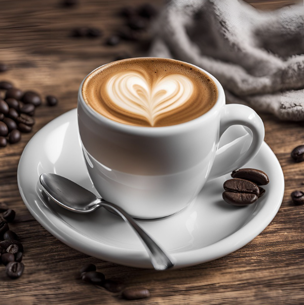
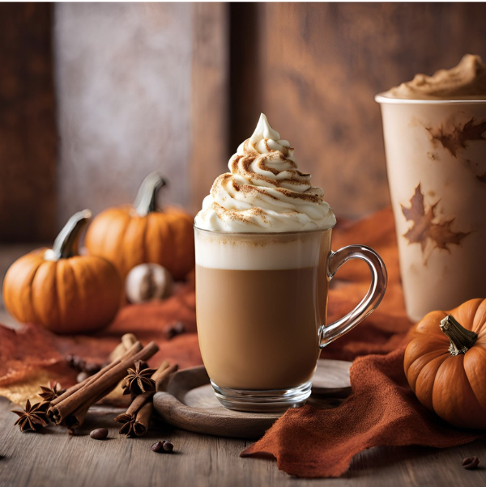
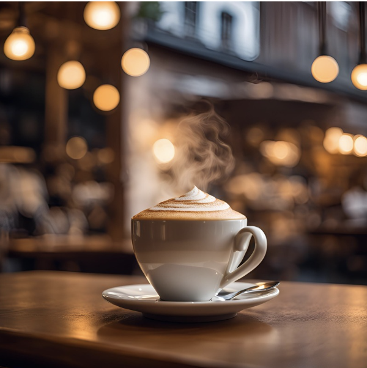
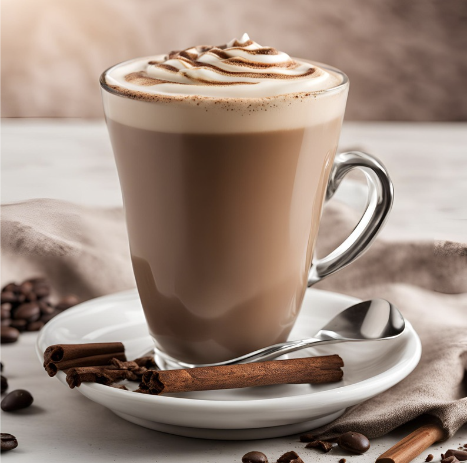
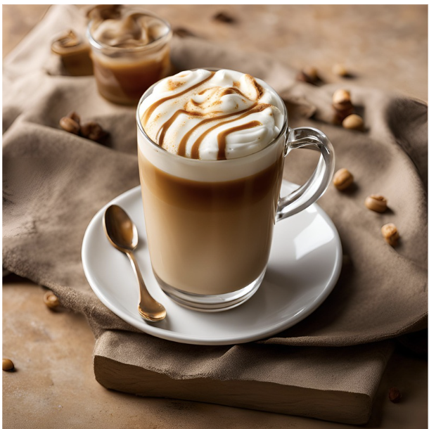

# ☕ Welcome to DNHS Cafe

**Come for the coffee, stay for the cozy vibes.**  
*Enjoy a range of your favorite brews using dneros, our exclusive currency!*

---
## Menu

### **House Favorites**

- **Classic Espresso**  
  A bold shot of espresso, perfect for a quick boost.  
  **Price:** 5 dneros  

- **Cappuccino**  
  Steamed milk and frothy foam topped with a hint of cinnamon.  
  **Price:** 8 dneros  

- **Mocha Latte**  
  A sweet blend of espresso, milk, and chocolate.  
  **Price:** 10 dneros  

### **Seasonal Specials**

- **Pumpkin Spice Latte**  
  The cozy flavors of fall in a cup, perfect for crisp days.  
  **Price:** 12 dneros  

- **Vanilla Caramel Macchiato**  
  Creamy vanilla meets rich caramel for a truly indulgent treat.  
  **Price:** 11 dneros  

### Points: 50 dneros

| Image                          | Coffee                        | Cost (dneros) | Action   |
|--------------------------------|-------------------------------|---------------|----------|
|  | **Classic Espresso**          | 15            | <button class="buy-button" onclick="buyCoffee(15)">Buy</button> |
|  | **Pumpkin Spice Latte**       | 20            | <button class="buy-button" onclick="buyCoffee(20)">Buy</button> |
|  | **Cappuccino**                | 18            | <button class="buy-button" onclick="buyCoffee(18)">Buy</button> |
|  | **Mocha Latte**               | 22            | <button class="buy-button" onclick="buyCoffee(22)">Buy</button> |
|  | **Vanilla Caramel Macchiato** | 25            | <button class="buy-button" onclick="buyCoffee(25)">Buy</button> |

---

1. Choose your favorite drink(s).

2. Message us to confirm your order.

3. Enjoy the cozy vibes and delicious flavors of DNHS Cafe!

*Thank you for visiting DNHS Cafe! We hope our cozy corner brings you a taste of joy and warmth.*

<a href="{{site.baseurl}}/dnhscafestudyroom">
<button style="background-color: #e4bc84; color: white; padding: 10px"> Take Me To DNHS Cafe Study Room! </button>
</a>